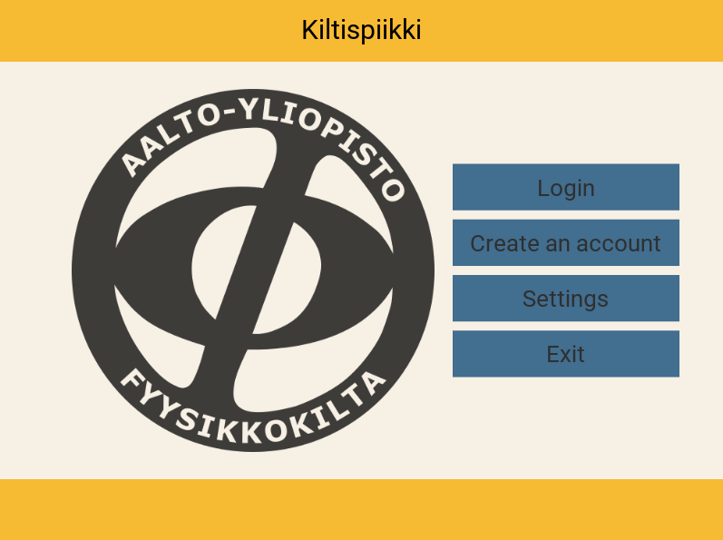
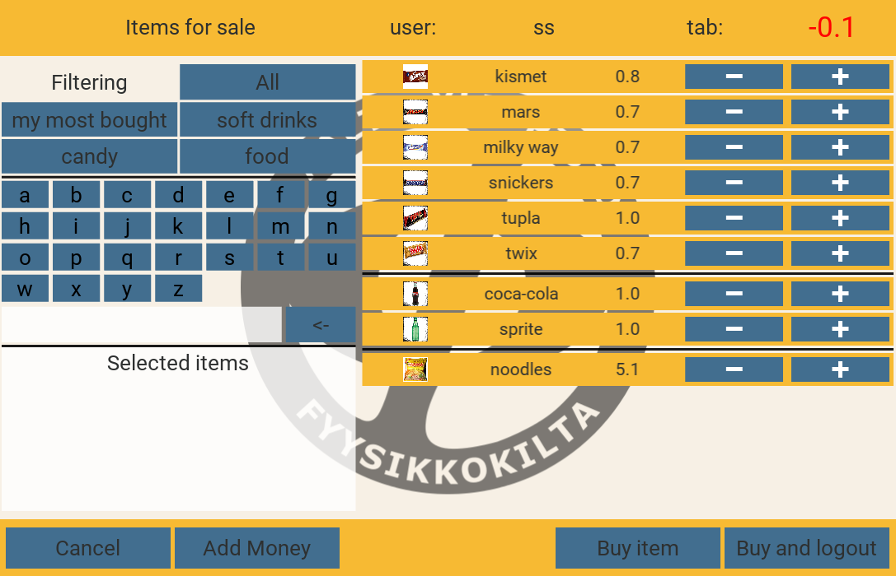
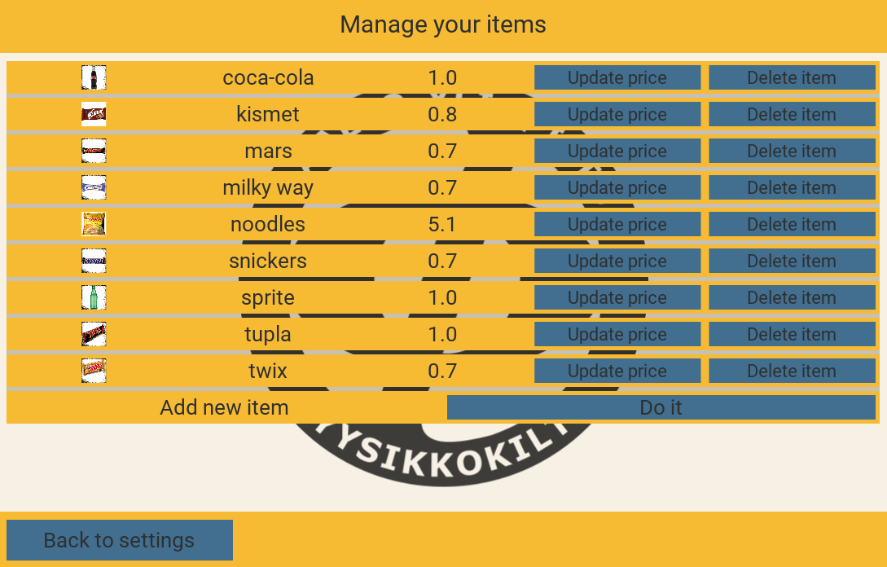
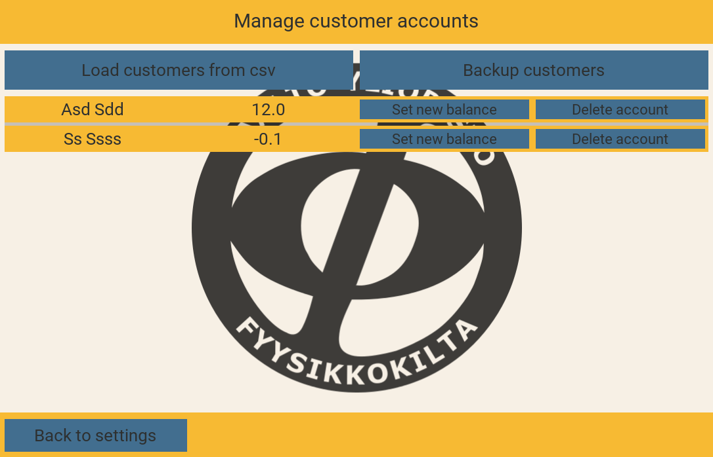

# Kiltispiikki


Kiltispiikki uses 


* platform independent python package <emph>Kivy</emph> for the GUI
* sqlite3 database 
* Google drive for automatic back ups


## Installation

Install kivy following the kivy installation guide (pick right platform) 

https://kivy.org/docs/installation/installation.html

install kivy dependencies on RasPi

```
$ sudo apt-get update
$ sudo apt-get install libsdl2-dev libsdl2-image-dev libsdl2-mixer-dev libsdl2-ttf-dev \
   pkg-config libgl1-mesa-dev libgles2-mesa-dev \
      python-setuptools libgstreamer1.0-dev git-core \
	     gstreamer1.0-plugins-{bad,base,good,ugly} \
		    gstreamer1.0-{omx,alsa} python-dev cython
```

install kivy (RasPi only found old package versions of cython so had to rename the old version first)

```
$ sudo pip install git+https://github.com/kivy/kivy.git@master
```

Kiltispiikki uses google play api to make backups to google drive. Install google-api with

```
$ pip install --upgrade google-api-python-client
```

Go to your home folder and clone the git repo

```
$ git clone https://github.com/miikama/kiltispiikki.git
```

Before first run on a new user go to the folder piikki/drive_init/ and run (not necessarily required if not on rasperry)

```
$ python drive_auth_init.py --noauth-local-webserver
```

This starts the authentication flow for the google drive, it should direct the user to browser to login in to a google account. Kiltispiikki is currently configured for hupimestari account. A new account will require for the user to go to google developers console and create a new oauth2 token and download their own client_secret file to the folder drive_init/

On a computer you are now set up. On Rasperry continue to the next phase.

### Setting up on Rasperry

on rasperry the user needs to be added to the video user group to be able to open up a GUI and give access to input

```
$ sudo usermod -a -G video username
$ sudo chmod /dev/input/event*
$ sudo apt-get install xclip
```

The touch events are mirrored on rasperry. The first working way to fix this is to modify kivy source code. 

```
 $ sudo vim /usr/local/lib/python2.7/dist-packages/kivy/input/providers/hidinput.py
```

find functions assign_coord AND assign_rel_coord and before the first if sentence inside the function add line

```
p = cx; cx = cy; cy = p

```


### Setting up touchscreen

The touch screen used is waveshare 10.1" lcd touch screen 

https://www.waveshare.com/wiki/10.1inch_HDMI_LCD

Copy the driver "LCD-show" to the rasperry. Your home folder is fine. extract the archive with

```
$ tar xvf "filename"
```

the go to the folder and run the correct driver 

```
$ sudo ./LCD101-"something"
```
the touch screen should now start


## Gallery

#### The landing screen



### The buy screen

Allows filtering and presents customer his most bought items, all buys are stored in sqlite database




### Item management screen

allows adding, deleting or modifying items



### customer management screen

allows modifying customer accounts. Backing up/retrieving the customer data to/from google drive




